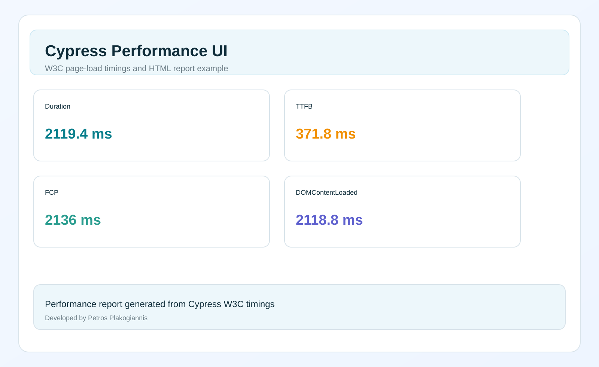

# Cypress performance UI

Performance testing directly inside your Cypress tests. Collect browser-native metrics and generate visual HTML reports — no Lighthouse required.

### Report preview




## Install

```bash
npm install --save-dev cypress-performance-ui
```

## Use in Cypress

### Option 1: auto-register in support file

```js
import "cypress-performance-ui";
```

### Option 2: explicit registration

```js
const { registerPerformanceCommands } = require("cypress-performance-ui");

registerPerformanceCommands();
```

## Commands

### `cy.collectPageLoadMetrics(pageName)`

Collects browser performance timings from `window.performance`.

```js
it("measures page load", () => {
  cy.visit("/landing");

  cy.collectPageLoadMetrics("Landing page").then((metrics) => {
    console.log(metrics);
  });
});
```

Returns:

```js
{
  pageName: "Landing page",
  timestamp: "2026-10-02T12:00:00.000Z",
  url: "https://example.com/landing",
  metrics: {
    duration: 1678.2,
    responseStart: 123.5,
    domContentLoaded: 786.3,
    loadEventEnd: 1498.8,
    firstContentfulPaint: 442.4,
    navigationStart: 0
  }
}
```

### `cy.measureW3CTimings(pageName)`

A convenience wrapper for W3C Performance API timing values.

```js
it("collects W3C timings", () => {
  cy.visit("/landing");

  cy.measureW3CTimings("Landing Page").then((data) => {
    console.log(data.w3cTimings);
  });
});
```

### `cy.generatePerformanceReport(filePath)`

Generates a page-load report in HTML from the collected timing metrics.

```js
it("writes HTML report", () => {
  cy.visit("/landing");

  cy.generatePerformanceReport("cypress/performance/reports/performance-report.html").then((result) => {
    console.log(result.filePath);
  });
});
```

## W3C timing values used

This package focuses on timings that are commonly used in browser performance analysis:

- navigationStart
- responseStart
- domContentLoaded
- loadEventEnd
- firstContentfulPaint
- duration

## GitHub showcase

This repository includes a reusable report preview alongside the full HTML dashboard example.

### Report preview


The static SVG is a preview of the real dashboard layout. The full rendered HTML report is available in [assets/performance-report.html](./assets/performance-report.html).

## Author

Petros Plakogiannis

## License

MIT
